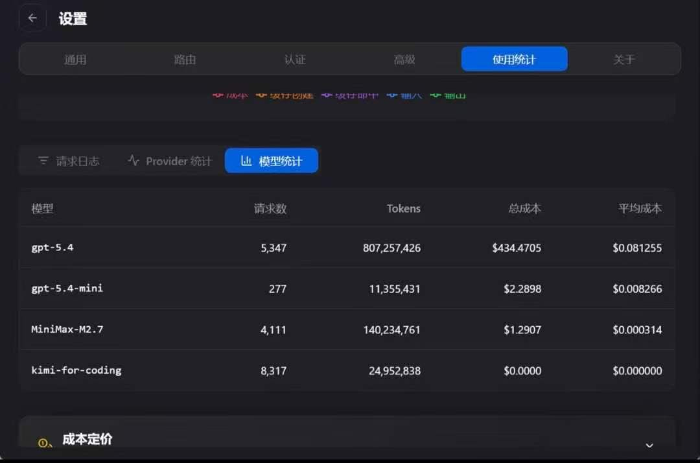

# Enterprise AI Agent Platform

Enterprise-grade Multi-Agent Workflow System powered by GPT / Claude / DeepSeek.

---

## Dashboard Preview

### System Analytics

### Model Usage Statistics

---

## Features

- Multi-Agent Collaboration
- Autonomous Workflow Engine
- AI Sales Agent
- AI Customer Support Agent
- Browser Use Agent
- Computer Use Agent
- Workflow Orchestration
- Long Context Memory
- Tool Calling System
- RAG Knowledge Base

---

## Architecture

- API Gateway
- Agent Router
- Workflow Scheduler
- Model Provider Layer
- Vector Database
- Task Queue System

---

## Current Progress

- [x] GPT Integration
- [x] Claude Integration
- [x] DeepSeek Integration
- [x] Multi-Agent Workflow
- [x] RAG Knowledge Base
- [x] CRM Automation
- [x] Content Generation
- [ ] Autonomous Decision Engine
- [ ] AI Operating System

---

## Performance

- 300w+ Daily Requests
- 1B+ Monthly Tokens
- 5000+ Concurrent Tasks
- 20+ Workflow Templates

---

## Tech Stack

- Python
- FastAPI
- Redis
- PostgreSQL
- Docker
- Kubernetes

---

## Current Status

Production-scale AI Workflow System for enterprise automation and intelligent task orchestration.
